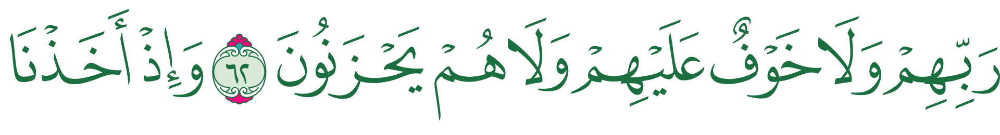

# remotion-mushaf-line-renderer

[](https://github.com/tlawat/remotion-mushaf-line-renderer/actions/workflows/ci.yml)
[](LICENSE)

A React component for [Remotion](https://www.remotion.dev) that draws one line of the Quran the way
it is printed on a page of the Madinah mushaf (KFGQPC V4, 1441H). You give it a page and a line
number, or a surah and an ayah range. It draws the words with the same glyphs, the same line breaks
and the same spacing as the printed page, and it can animate the line in and out.

It was built for recitation videos: the ayat appear line by line, in time with the audio, and each
line looks like the page a reader knows.



## The problem it solves

You might expect to put the Arabic text of an ayah in a `<div>` with a good Arabic font. That gives
you readable Arabic, but not the mushaf:

- **The line breaks are wrong.** The printed mushaf has fixed lines: every page has 15 of them (the
  first two pages have 8), and a line often ends in the middle of an ayah. The browser breaks lines
  wherever the text happens to fit, so your line will not match the page.
- **The letters and the spacing are wrong.** The printed page was typeset by hand: stacked letters,
  stretched letters, tuned spacing between words. An ordinary Arabic font cannot reproduce it, and
  the browser's justification adds gaps of its own.
- **Remotion may capture the wrong font.** Remotion screenshots every frame. If the font has not
  finished loading, the frame is captured with a fallback font and you get a glitch in the video.

The [Quranic Universal Library (QUL)](https://qul.tarteel.ai) solved the first two problems. It
publishes:

1. **One font per page** (604 fonts). In each font every word of that page is a single glyph that
   is already drawn exactly as printed, spacing included.
2. **The word list.** For every word: its surah, ayah and position, and the character code that
   selects its glyph. The same code means a different word on each page, so a code only makes sense
   together with its page's font.
3. **The page layout.** Which words sit on which line of which page.

Using this data by hand is tedious. You have to download and join the word list and the layout, find
the page an ayah is on, load the right font for each page, wait for it before Remotion captures a
frame, place each word without letting CSS add spacing, and handle the colour version of the fonts.
This package does all of that for you.

## What you get

- **`getMushafLines()`**: ask for a page, or for a surah and an ayah range. You get one plain JSON
  object per printed line: the page, the line number and the words. You do not need to know which
  page an ayah is on. Call it in `calculateMetadata()`, so it runs once per render. The result can be
  saved, passed through `inputProps` and rendered on Lambda.
- **`<MushafLine>`**: renders one of those lines. It loads the page font and holds the render with
  `delayRender()` until the font is ready, so a frame is never captured with a fallback font. Each
  word is its own `<span>`, so you can style or highlight single words, for example the word being
  recited.
- **Colours.** By default the words take the CSS `color` you set, like any text. You can also pick
  one of the colour themes from QUL's preview page (tajweed colours, dark, sepia and others), or
  write your own theme.
- **Showing part of a line.** A line often starts with the end of one ayah and ends with the start
  of another. `slice` shows only the ayahs you ask for, centred, at the same size as the full line.
- **Entrances and exits.** `enter` and `exit` accept the presentations of `@remotion/transitions`
  (`fade()`, `slide()`, `wipe()` and others) and two made for text: `slideFade()` and `revealRtl()`.
  The line animates within the `<Sequence>` it is placed in, so there is no timing prop to learn.
- **Clear errors.** Every failure is a `MushafError` with a stable `code` and a message that says what
  to change: a page that does not exist, a font that failed to download, an ayah past the end of a
  surah, and so on.

## What it does not do (yet)

- **Surah headers and the basmalah** are not drawn. `getMushafLines()` returns those lines with no
  words, and `<MushafLine>` throws `UNSUPPORTED_LINE_TYPE` if you pass one. Skip them, or draw your
  own. They need two other QUL fonts and are on the roadmap.
- **Only one mushaf is supported:** KFGQPC V4, the 15-line Madinah print.
- **It needs the network, unless you mirror the files.** The package contains no Quran data and no
  fonts. By default it downloads the word list and the layout (about 1.2 MB, once per browser tab)
  and each page font (about 300 KB, once per page) from QUL's CDN while rendering. For offline or
  reproducible renders, copy the files into your project's `public/` folder and point the package at
  them. The [package documentation](packages/remotion-mushaf-line-renderer/README.md#data) shows how.

## Usage

The package is not on npm yet. Until the first release, clone this repository and build it (see
[Run the example](#run-the-example)). Once it is published:

```bash
npm install remotion-mushaf-line-renderer
```

It needs `remotion` and `@remotion/transitions` 4.0.374 or newer, and React 18 or newer.

A video that shows At-Tawbah 9:1-11, one printed line after another, each on screen for two seconds:

```tsx
import {AbsoluteFill, Composition, Sequence, useVideoConfig, type CalculateMetadataFunction} from 'remotion';
import {MushafLine, getMushafLines, slideFade, type MushafLineData} from 'remotion-mushaf-line-renderer';

type Props = {lines: MushafLineData[] | null};

const HOLD = 60; // frames each line stays on screen

// Runs once per render: find the lines, then set the duration from how many there are.
const calculateMetadata: CalculateMetadataFunction<Props> = async ({props}) => {
  const lines = props.lines ?? (await getMushafLines({surah: 9, fromAyah: 1, toAyah: 11}));
  return {props: {lines}, durationInFrames: HOLD * lines.length};
};

const Passage: React.FC<Props> = ({lines}) => {
  const {fps} = useVideoConfig();
  return (
    <AbsoluteFill style={{backgroundColor: '#fbf7ee', color: '#1b1b1b', justifyContent: 'center'}}>
      {lines!.map((line, i) => (
        // premountFor mounts the line a second early, so its font is loaded before it appears.
        <Sequence key={line.line} from={i * HOLD} durationInFrames={HOLD} premountFor={fps} layout="none">
          <MushafLine line={line} enter={slideFade()} exit={slideFade()} />
        </Sequence>
      ))}
    </AbsoluteFill>
  );
};

export const Root = () => (
  <Composition
    id="Passage"
    component={Passage}
    calculateMetadata={calculateMetadata}
    width={1920}
    height={1080}
    fps={30}
    durationInFrames={1}
    defaultProps={{lines: null}}
  />
);
```

A few things to know:

- **Why resolve in `calculateMetadata()`?** You could write `<MushafLine page={187} line={2} />`
  and let the component look the line up itself. That works, but then every browser tab of a render
  looks the line up again, and the video's length cannot depend on the number of lines.
- **The line is sized to the video.** It fills the width of the composition by default. Pass
  `fontSize` to change that, or use `fontSizeForWidth(width - 2 * margin)` to leave margins.
- **In a `<Player>`,** `calculateMetadata()` does not run. Pass the resolved `lines` as props, and
  call `loadPageFont()` early so the first line does not appear late.

The [package documentation](packages/remotion-mushaf-line-renderer/README.md) covers every prop,
themes, sizing, slicing, animation, fonts, data mirrors, per-word styling and the full list of error
codes. It is also the README that npm will show.

## Run the example

The [`example/`](example) folder is a Remotion project that uses the package the way an app would:
three lines of a page with different animations, a recitation of At-Tawbah synced to its timings,
and a `<Player>` page used by the browser tests.

You need [Bun](https://bun.sh) 1.2+ and Node.js 20+.

```bash
git clone https://github.com/tlawat/remotion-mushaf-line-renderer.git
cd remotion-mushaf-line-renderer
bun install
bun run build   # build the package; the example uses the built output
bun run dev     # open the Remotion Studio on the example
```

The [example README](example/README.md) explains each composition and its props.

## What is in this repository

| Path                                                                               | What it is                                                                                                  |
| ---------------------------------------------------------------------------------- | ----------------------------------------------------------------------------------------------------------- |
| [`packages/remotion-mushaf-line-renderer`](packages/remotion-mushaf-line-renderer) | The package: the component, the functions that find lines, the loader for QUL's data, the font loader.      |
| [`example`](example)                                                               | The example Remotion project, plus a mirror of QUL's data in `example/public/data` used by the tests.       |
| [`scripts`](scripts)                                                               | The `qul` command-line tool (`bun run qul`): downloads QUL's data and fonts, and checks them for problems. |
| [`docs`](docs)                                                                     | How the code is organised, and notes on how QUL's fonts behave.                                             |

Further reading:

- [Architecture](docs/architecture.md): how a line goes from QUL's files to a frame, and which file
  does each step.
- [KFGQPC V4 rendering notes](docs/kfgqpc-v4-rendering-notes.md) and
  [lessons learned with the QUL fonts](docs/qul-fonts-lessons-learned.md): what the fonts contain and
  the mistakes to avoid when using them.
- [Changelog](packages/remotion-mushaf-line-renderer/CHANGELOG.md).

## Contributing

Bug reports, questions and pull requests are welcome. [CONTRIBUTING.md](CONTRIBUTING.md) explains the
tools (Bun, Biome, Vitest, Playwright), the test suites, the data tool and the rules about the fonts.

## Licences

The code is [MIT](LICENSE).

The package ships no Quran data and no fonts; it downloads them while rendering.

- The word list and the page layout are open data published by [QUL](https://qul.tarteel.ai).
  Mirroring them is fine.
- The fonts were made by the [King Fahd Complex](https://qurancomplex.gov.sa) and are published by
  QUL. You may copy them into your project to render your own videos, but do not redistribute them
  (in a public website or in a package) unless their licence allows it.

Please respect both licences when you publish videos or mirror the files.
